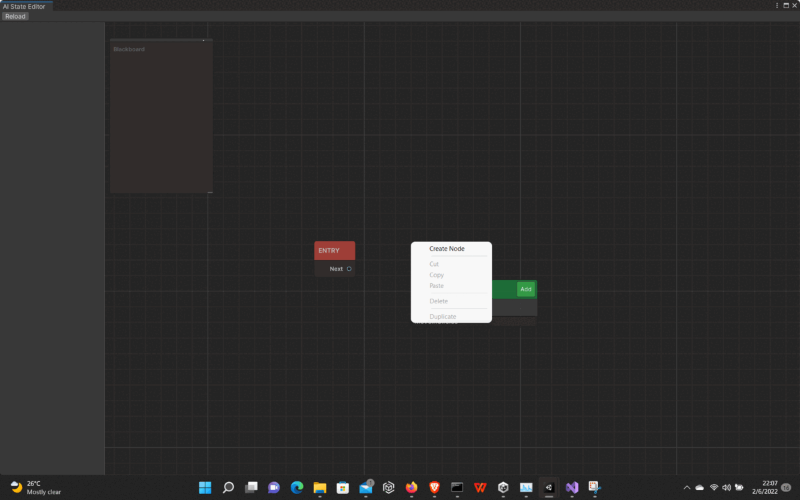

# State Machine    

---
State Machine is a library that enables developers to create AI or any state-based system.

State Machine includes:

- A graphical tool used for managing and creating states and conditions within a state machine.
- An API that allow developers to create a state machine of any Unity Component type.

&#42; Available via the **com.udomdev.statemachine** package

## About
This package is serves as a library to make state-based systems like AI, and dialogue systems. 

## Dependencies
This package requires the Unity UI Toolkit package to operate. Go to

## State Machine components
A state machine is made up of 3 components: 
1. **State**: This represents a state or set of action within a system.<br/> (For example: fighting, searching and resting in RPGs)

1. **Condition**: This represents a certain condition or a set of actions that must be completed to enter a state<br/> (For example: If an enemy see the player, the enemy procedes to pursue the player)

1. **Manager**: This manages all the states and condition within the system.

## How To Use 
These are the major steps in order to use this package:  

1. Create a class for your State Manager
1. Create a base class for your States (Optional)
1. Create a base clase for your conditions (Optional)
1. Create derived State classes
1. Create derived Condition classes
1. Create a state manager asset

### Creating The Class for your State Manager
Create a class that derives from the generic StateManager class by
- Using the namespace **StateMachine**
- Deriving from the generic class **StateManager\<T\>** where T is a Unity Component type parameter
 
```
using System;
using System.Collections;
using System.Collections.Generic;
using StateMachine;
using UnityEngine;

[CreateAssetMenu(fileName = "State Machine/Transform Sample", menuName = "New Transform Sample")]
public class SampleTransformStateManager : StateManager<Transform>
{

    public override Type GetStateType()
    {
        return typeof(SampleTransformBaseState);
    }

    public override Type GetConditionType()
    {
        return typeof(SampleTransformBaseCondition);
    }
}

```

### Creating The Base Class for your States 
Create a abstract class from the generic State class by
- Using the namespace **StateMachine**
- Deriving from the generic class **State\<T\>** where T is a Unity Component type parameter
- Make sure to use the same type parameter as above

(This is optional, but It is highly advised to do)
```
using System.Collections;
using System.Collections.Generic;
using UnityEngine;
using StateMachine;

public abstract class SampleTransformBaseState : State<Transform>
{
    
}
```

### Creating The Base Class for your Condition
Create an abstract class from the generic Condition class by
- Using the namespace **StateMachine**
- Deriving from the generic class **Condition\<T\>** where T is a Unity Component type parameter
- Make sure to use the same type parameter as above

```
using System.Collections;
using System.Collections.Generic;
using UnityEngine;
using StateMachine;

public abstract class SampleTransformBaseCondition : Condition<Transform>
{ 
    
}

```

### Create Derived State classes
Create State classes that derived from 
- The base State class created above or 
- The base generic State class of same type parameter(In this case "State\<Transform\>")
```
using System.Collections;
using System.Collections.Generic;
using UnityEngine;

public class MoveInCircles : SampleTransformBaseState
{
    public float length = 20;
    public List<Vector3> points;
    public int noOfPoints = 20;
    public float speed = 10;
    public int index;
    public bool rotatePoints;
    public float rotateAngularSpeed = 5;
    public override void OnEnd(Transform obj)
    {
        
    }

    public override void OnGizmos(Transform obj)
    {
        for(int i = 0; i < points.Count; i++)
        {
            var point = points[i];
            Gizmos.color = index == i ? Color.red : Color.green;
            Gizmos.DrawSphere(point, 0.5f);
            Gizmos.color = Color.white;
            Gizmos.DrawLine(point, points[(i + 1) % points.Count]);
        }

    }

    public override void OnStart(Transform obj)
    {
        points.Clear();
        index = 0;
        float radDiv = 360 / noOfPoints;
        Vector3 startPoint = new Vector3(-length/2, 0, 0);
        startPoint = Quaternion.Euler(0, 45f, 0) * startPoint;
        points.Add(startPoint);
        for(int i = 1; i < noOfPoints; i++)
        {
            Debug.Log(i - 1);
            points.Add(Quaternion.Euler(0, radDiv, 0) * points[i - 1]);
        }
      
    }

    public override void OnUpdate(Transform obj)
    {
        var dir = (points[index] - obj.transform.position).normalized;
        obj.transform.position += speed * Time.deltaTime * dir;
        obj.forward = Vector3.Lerp(obj.forward, dir, Time.deltaTime * 8f);
        if (Vector3.Distance(obj.transform.position, points[index]) < 1f)
        {
            index = ++index % points.Count;
        }

        if (rotatePoints)
        {
            for(int i = 0; i < points.Count; i++)
            {
                points[i] = Quaternion.Euler(0, rotateAngularSpeed * Time.deltaTime, 0) * points[i];
            }
        }
    }
}

```

### Create Derived Condition classes
Create Condition classes that derived from 
- The base Condition class created above or 
- The base generic Condition class of same type parameter(In this case "Condition\<Transform\>")
```
using System.Collections;
using System.Collections.Generic;
using UnityEngine;


public class SampleKeyCondition : SampleTransformBaseCondition
{
    float lastValue = 0;
    public bool useTimer = false;
    public KeyCode key;
    
    public override bool Check(Transform value)
    {
        if (useTimer)
        {
            var currentValue = (Time.time * 1000) % 10000;
            if (lastValue > currentValue)
            {
                lastValue = currentValue;
                return true;
            }
            Debug.Log(currentValue + " " + lastValue);
            lastValue = currentValue;
        }
       
        return Input.GetKeyDown(key);
        
        
    }
}
```
### Create the asset
Create the scriptable object asset of the State Manager derived class.


- Double click on it to open the graph to use.

- Create a state node


- Create a condition node
 


- Make your connections


Enjoy!!
